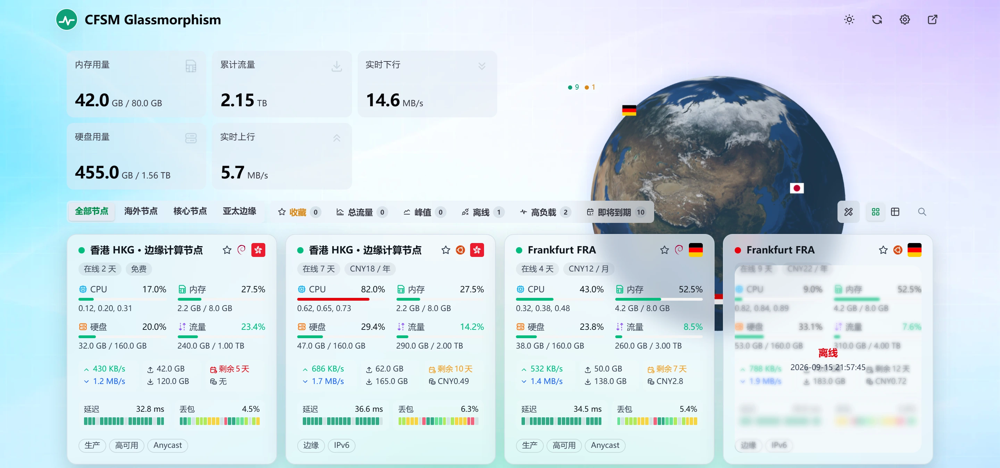
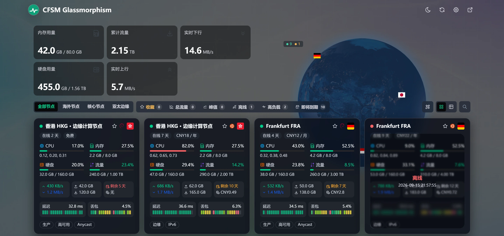
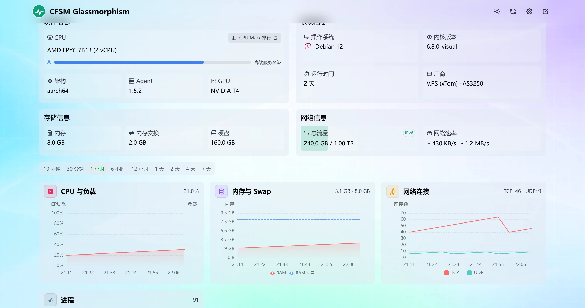
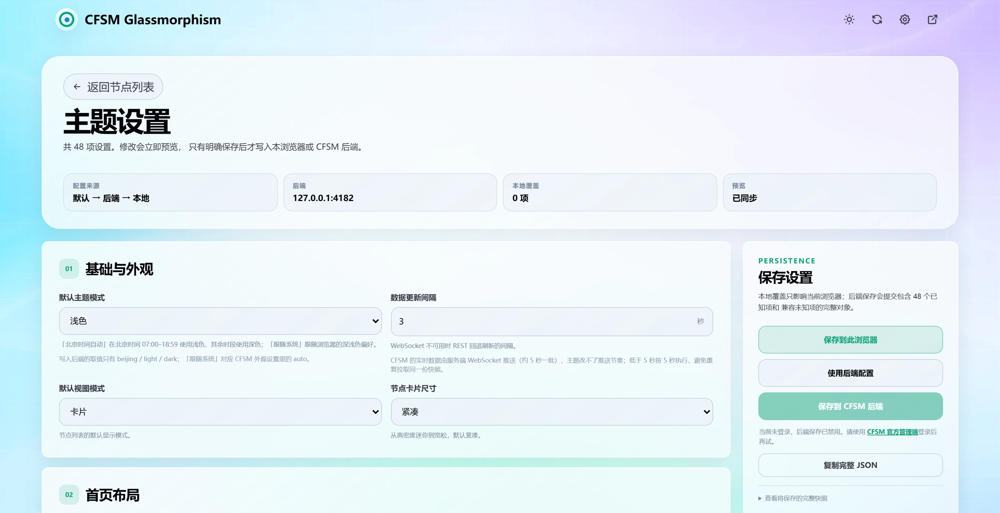

# CFSM Glassmorphism

面向 [CF-Server-Monitor](https://github.com/huilang-me/CF-Server-Monitor) 的第三方毛玻璃风格主题，基于 [Komari Glassmorphism](https://github.com/sanrokamlan-prog/komari-theme-Glassmorphism) 移植，使用 Vue 3 + TypeScript + Vite 构建。

当前稳定版本 **v1.1.11**。

## 预览

**首页 · 浅色**



**首页 · 深色**



**节点详情 · 信息卡与历史图表**



**主题设置 · 46 项可调，改完即时预览**



> 截图使用本地演示数据生成，非真实节点；顶栏图标为演示图标，实际会显示你在 CFSM 后台设置的网站图标。

## 特性

**首页**

- 总览统计卡片，卡片组合可在主题设置中自选。
- 剩余价值、月费用、年费用汇总卡，可打开「价值与费用明细」，支持多币种显示与手动汇率。
- 三种地球 / 地图渲染：贴图地球、点阵地球、平铺地图，可关闭。
- 卡片与列表两种视图；卡片提供迷你、紧凑、舒适、宽松四档密度。
- 分组切换、搜索，以及收藏、总流量、峰值、离线、高负载、即将到期等快捷筛选。
- 节点卡展示 CPU、内存、硬盘、流量、实时网速、延迟与丢包窗口、自定义标签与离线状态。
- 首页实时总上行 / 总下行按 Angel 的 WSS 上报轮次整体刷新，不再因多节点消息错峰而在同一轮连续跳出多个中间合计。

**节点详情**

- 概览指标卡，卡片组合可在主题设置中自选。
- 硬件、系统、存储、网络四张信息卡，含 CPU 型号跑分参考与厂商标识。
- 负载图表：CPU 与负载、内存与 Swap、磁盘、实时网络、累计流量、网络连接、进程、磁盘 IO、GPU，按数据可用性自动增减。
- 负载图提供「实时」档位，逐条显示 Angel 按 WSS 上报间隔送达的真实样本；切换固定时间范围后再返回仍会继续更新。
- 延迟区：按探测目标查看平均延迟、丢包率与波动率，支持多目标叠加，并可隐藏短时尖峰。

**主题设置**

- 内置设置页（`/#/settings`），46 项可调设置。
- 三层配置：主题默认值 → CFSM 后端 `theme_options` → 当前浏览器覆盖。
- 可只保存到当前浏览器，也可在登录后保存到 CFSM 后端供所有访客共享。

**其它**

- 明暗模式与四套配色预设，另支持自定义配色与色觉友好模式。
- 自定义背景图片或视频、背景模糊与遮罩。
- WebSocket 实时订阅，连接不可用时自动降级为 REST 回退刷新。
- 缺失、超时与未配置的数据保持为空或断点，不会显示成 0。
- 财务换算使用访客浏览器直接获取的每日参考汇率（`open.er-api.com`，备用 `api.frankfurter.dev`），不经过 CFSM 后端；只有价格可见且需要换算时才会请求。

## 使用方法

### 一、安装主题

在 CFSM 管理端打开 **主题商店 → 自定义主题 URL**，填入下面任一地址后点「应用自定义」：

```text
https://github.com/allury/CFSM-Glassmorphism/tree/theme-v1.1.11
```

```text
https://github.com/allury/CFSM-Glassmorphism/tree/theme-dist
```

- `theme-v1.1.11` 是不可变标签，指向该版本已验证的构建产物，**推荐使用**：内容不会变，升级时机由你决定。
- `theme-dist` 是滚动分支，始终跟随最新稳定版。用它可以自动拿到新版本，但**发布新版后可能需要手动重新应用一次**：CFSM 按地址分别缓存 `index.html` 与各个资源文件，分支前移时两者的缓存不一定同时刷新，可能出现页面暂时空白。重新应用一次即可恢复，固定标签不存在这个问题。

也可以从 [Releases](https://github.com/allury/CFSM-Glassmorphism/releases/latest) 下载 `CFSM-Glassmorphism-v1.1.11.zip` 手动安装：压缩包根目录只有 `index.html` 与 `assets/`，解压后按 CFSM 的主题安装流程放置即可。

如需回退到上一个版本，把自定义主题 URL 换成 `https://github.com/allury/CFSM-Glassmorphism/tree/theme-v1.1.10` 重新应用。

### 二、调整主题设置

应用主题后，点击右上角齿轮图标，或直接访问 `https://<你的站点>/#/settings`。

1. 修改任意设置会**立即预览**，不会自动保存。
2. 「保存到此浏览器」只影响当前浏览器，适合访客自己调整卡片尺寸、明暗等。
3. 「保存到 CFSM 后端」需要先在 CFSM 官方管理端登录，保存后对所有访客生效。
4. 「使用后端配置」清除本浏览器的覆盖，回到站点统一配置。

常用设置：

| 需求 | 设置项 |
|---|---|
| 首页卡片密度 | 基础与外观 → 节点卡片尺寸 |
| 卡片 / 列表视图 | 基础与外观 → 默认视图模式 |
| 配色与明暗 | 基础与外观 → 默认主题模式；首页布局 → 毛玻璃配色方案 |
| 关闭地球 | 首页布局 → 隐藏地球 / 隐藏头部 |
| 首页公告 | 首页布局 → 启用公告、公告标题、公告内容 |
| 总览卡片组合 | 首页总览卡片 → 头部卡片方案 |
| 详情页图表组合 | 节点详情图表 → 详情负载图方案 |
| 自定义背景 | 自定义背景 → 启用自定义背景、背景地址 |

### 三、可选：为节点标注厂商

主题会从节点名称、分组、地区和标签中识别厂商。若要补充 ASN 与组织名，在 CFSM 后台该节点的**标签**里按下面格式填写：

```text
AS3258
org xTom Japan Corporation
```

ASN 可写成 `AS3258`、`asn AS3258` 或 `asn-3258`；组织名前缀与名称之间必须有空格、`-` 或 `_`。CFSM 保存标签时会过滤冒号，所以不要写成 `org:xxx`。主题只读取运营者填写的文本，不查询 IP，也不访问任何外部数据库。

## 兼容性

- 已在 CF-Server-Monitor Worker `2.8.5 Stable` 与 `2.8.5 Beta5` 上实测；更早版本未验证。
- 仅使用 CFSM 公开的第三方主题接口：`/api/config`、`/api/servers`、`/api/server`、`/api/history/all`、`/api/ws`，以及保存主题配置的 `POST /api/theme_options`。
- 管理入口链接到 CFSM 自带的 `/admin#admin`，主题本身不实现管理后台。
- 国旗与操作系统图标取自 CFSM 默认皮肤（`/flags/`、`/os-icons/`），不打包进主题。
- 站点后台关闭价格、到期或三网详情时，主题会同步隐藏对应内容。

## 常见问题

**价格、到期或流量配额没有显示？** 这些受站点后台的显示开关控制，关闭后主题不会显示。

**延迟和丢包是空的？** 需要在 CFSM 后台开启三网详情，否则接口返回空窗口，主题不会用占位数据填充。

**详情页历史最长只有 24 小时？** 未登录访问时 CFSM 限制历史长度，登录后可查看更长区间。

**磁盘耗尽预测不显示？** 该功能需要把详情页的时间范围选到 2 天以上，样本不足时不会给出预测。

## 来源与许可

- 视觉与交互移植自 [sanrokamlan-prog/komari-theme-Glassmorphism](https://github.com/sanrokamlan-prog/komari-theme-Glassmorphism)，数据层改写为 CF-Server-Monitor 的公开主题接口。原主题的视觉设计不主张为本项目原创。
- 主题接口与协议依据 CF-Server-Monitor 的 `theme-develop.md`。
- 许可证见 [LICENSE](LICENSE)。

## 开发

```bash
bun install
bun run dev          # 本地开发
bun run lint
bun run typecheck
bun run test
bun run build        # 产物输出到 dist/
bun run validate:dist
```

构建产物根目录只包含 `index.html` 与 `assets/`，符合 CFSM 对第三方主题的目录约定。CI 在推送 main、版本标签、Pull Request 时执行同一组质量门；推送 `v<版本>` 标签会发布 ZIP、更新 `theme-dist` 分支并创建不可变的 `theme-v<版本>` 标签。
